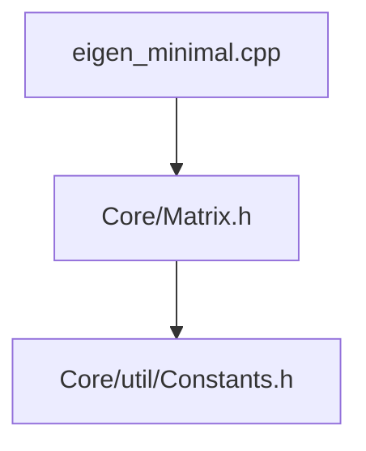

# A minimal version of Eigen

Here, I collect a minimal set of Eigen headers so that I
can learn what gets called from where.

We work with the following commit of Eigen

```
commit 0259a52b0efe75c78f48f8a21b8092cd3fff319f (HEAD -> master, origin/master, origin/HEAD)
Author: Markus Vieth <mvieth@techfak.uni-bielefeld.de>
Date:   Mon Mar 17 19:32:43 2025 +0100

    Use more .noalias()

```

Let's start with a simple example described in Eigen documentation [here](https://eigen.tuxfamily.org/dox/TopicInsideEigenExample.html).

```C++
#include <Eigen/Core>

int main()
{
    int size = 50;
    // VectorXf is a vector of floats, with dynamic size.
    Eigen::VectorXf u(size), v(size), w(size);
    u = v + w;
}

```

Our aim is to get an understanding of how this code works under the hood.
Eigen documentation already does a thorough job of explaning this. However,
to actually find stuff in the codebase is a bit tricky. We're trying to
complement the documenation by taking a course through the code base.

## Definition of `Eigen::VectorXf`

We start with the definition of `Eigen::VectorXf`. You can find this
at Line 478 of `Core/Matrix.h`

```c++
EIGEN_MAKE_TYPEDEFS_ALL_SIZES(float, f)
```

This actually calls a macro defined just above in line 468.

```C++
#define EIGEN_MAKE_TYPEDEFS_ALL_SIZES(Type, TypeSuffix) \
  EIGEN_MAKE_TYPEDEFS(Type, TypeSuffix, 2, 2)           \
  EIGEN_MAKE_TYPEDEFS(Type, TypeSuffix, 3, 3)           \
  EIGEN_MAKE_TYPEDEFS(Type, TypeSuffix, 4, 4)           \
  EIGEN_MAKE_TYPEDEFS(Type, TypeSuffix, Dynamic, X)     \
  EIGEN_MAKE_FIXED_TYPEDEFS(Type, TypeSuffix, 2)        \
  EIGEN_MAKE_FIXED_TYPEDEFS(Type, TypeSuffix, 3)        \
  EIGEN_MAKE_FIXED_TYPEDEFS(Type, TypeSuffix, 4)
```

The one we will need is `EIGEN_MAKE_TYPEDEFS(Type, TypeSuffix, Dynamic, X)`.
This in turn calls another macro define in line 449.

```C++
#define EIGEN_MAKE_TYPEDEFS(Type, TypeSuffix, Size, SizeSuffix)    \
  /** \ingroup matrixtypedefs */                                   \
  /** \brief `Size`&times;`Size` matrix of type `Type`. */         \
  typedef Matrix<Type, Size, Size> Matrix##SizeSuffix##TypeSuffix; \
  /** \ingroup matrixtypedefs */                                   \
  /** \brief `Size`&times;`1` vector of type `Type`. */            \
  typedef Matrix<Type, Size, 1> Vector##SizeSuffix##TypeSuffix;    \
  /** \ingroup matrixtypedefs */                                   \
  /** \brief `1`&times;`Size` vector of type `Type`. */            \
  typedef Matrix<Type, 1, Size> RowVector##SizeSuffix##TypeSuffix;
```

The one we will use is `typedef Matrix<Type, Size, 1> Vector##SizeSuffix##TypeSuffix;`.
As you can see the macro takes 4 arguments and for our example,
their values are as shown the table below:

| Argument     | Value     |
| ------------ | --------- |
| `Type`       | `float`   |
| `TypeSuffix` | `f`       |
| `Size`       | `Dynamic` |
| `SizeSuffix` | `X`       |

The result of this macro expansion is the definition of type `VectorXf`.

```C++
typedef Matrix<float, Dynamic, 1> VectorXf;
```

The template argument which tells Eigen that the size of the matrix
is not fixed is defined in `Core/util/Constants.h` line 25.

```C++
const int Dynamic = -1;
```

So, far the files we've used are


