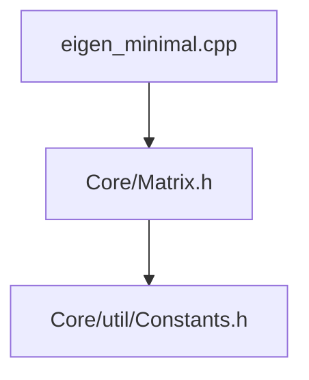
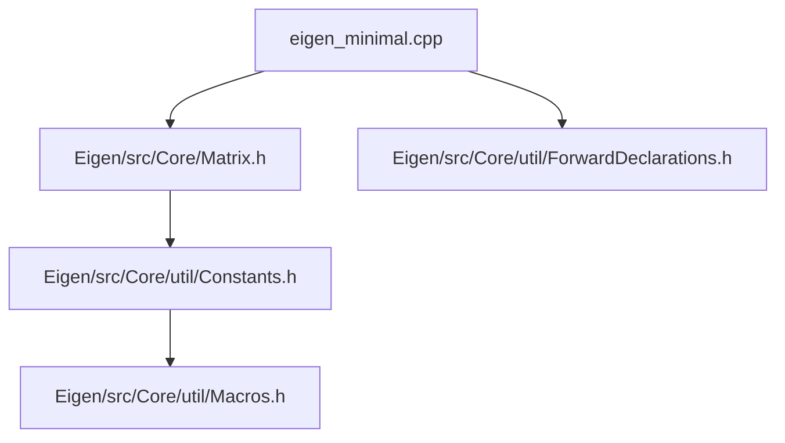

# A minimal version of Eigen

Here, I collect a minimal set of Eigen headers so that I
can learn what gets called from where.

We work with the following commit of Eigen

```
commit 0259a52b0efe75c78f48f8a21b8092cd3fff319f (HEAD -> master, origin/master, origin/HEAD)
Author: Markus Vieth <mvieth@techfak.uni-bielefeld.de>
Date:   Mon Mar 17 19:32:43 2025 +0100

    Use more .noalias()

```

Let's start with a simple example described in Eigen documentation [here](https://eigen.tuxfamily.org/dox/TopicInsideEigenExample.html).

```C++
#include <Eigen/Core>

int main()
{
    int size = 50;
    // VectorXf is a vector of floats, with dynamic size.
    Eigen::VectorXf u(size), v(size), w(size);
    u = v + w;
}

```

Our aim is to get an understanding of how this code works under the hood.
Eigen documentation already does a thorough job of explaning this. However,
to actually find stuff in the codebase is a bit tricky. We're trying to
complement the documenation by taking a course through the code base.

## Definition of `Eigen::VectorXf`

We start with the definition of `Eigen::VectorXf`. You can find this
at Line 478 of `Eigen/src/Core/Matrix.h`

```c++
EIGEN_MAKE_TYPEDEFS_ALL_SIZES(float, f)
```

This actually calls a macro defined just above in line 468.

```C++
#define EIGEN_MAKE_TYPEDEFS_ALL_SIZES(Type, TypeSuffix) \
  EIGEN_MAKE_TYPEDEFS(Type, TypeSuffix, 2, 2)           \
  EIGEN_MAKE_TYPEDEFS(Type, TypeSuffix, 3, 3)           \
  EIGEN_MAKE_TYPEDEFS(Type, TypeSuffix, 4, 4)           \
  EIGEN_MAKE_TYPEDEFS(Type, TypeSuffix, Dynamic, X)     \
  EIGEN_MAKE_FIXED_TYPEDEFS(Type, TypeSuffix, 2)        \
  EIGEN_MAKE_FIXED_TYPEDEFS(Type, TypeSuffix, 3)        \
  EIGEN_MAKE_FIXED_TYPEDEFS(Type, TypeSuffix, 4)
```

The one we will need is `EIGEN_MAKE_TYPEDEFS(Type, TypeSuffix, Dynamic, X)`.
This in turn calls another macro define in line 449.

```C++
#define EIGEN_MAKE_TYPEDEFS(Type, TypeSuffix, Size, SizeSuffix)    \
  /** \ingroup matrixtypedefs */                                   \
  /** \brief `Size`&times;`Size` matrix of type `Type`. */         \
  typedef Matrix<Type, Size, Size> Matrix##SizeSuffix##TypeSuffix; \
  /** \ingroup matrixtypedefs */                                   \
  /** \brief `Size`&times;`1` vector of type `Type`. */            \
  typedef Matrix<Type, Size, 1> Vector##SizeSuffix##TypeSuffix;    \
  /** \ingroup matrixtypedefs */                                   \
  /** \brief `1`&times;`Size` vector of type `Type`. */            \
  typedef Matrix<Type, 1, Size> RowVector##SizeSuffix##TypeSuffix;
```

The one we will use is `typedef Matrix<Type, Size, 1> Vector##SizeSuffix##TypeSuffix;`.
As you can see the macro takes 4 arguments and for our example,
their values are as shown the table below:

| Argument     | Value     |
| ------------ | --------- |
| `Type`       | `float`   |
| `TypeSuffix` | `f`       |
| `Size`       | `Dynamic` |
| `SizeSuffix` | `X`       |

The result of this macro expansion is the definition of type `VectorXf`.

```C++
typedef Matrix<float, Dynamic, 1> VectorXf;
```

The template argument which tells Eigen that the size of the matrix
is not fixed is defined in `Eigen/src/Core/util/Constants.h` line 25.

```C++
const int Dynamic = -1;
```

So, far the files we've used are



## Going deeper into `Matrix` the class

Now we're getting inside the skin. The obvious place to look is `Eigen/src/Core/Matrix.h`.
However, there's slight problem. We see that the matrix class is defined in 
line 186. However, we see that there're 6 template parameters required.

```C++
template <typename Scalar_, int Rows_, int Cols_, int Options_, int MaxRows_, int MaxCols_>
class Matrix : public PlainObjectBase<Matrix<Scalar_, Rows_, Cols_, Options_, MaxRows_, MaxCols_>>
```

We only specified 3 in the definition in the previous section. What's going on?
The key to this question lies in a file called `Eigen/src/Core/util/ForwardDeclarations.h`.
This file gets included in `Eigen/Core` in line 174. So we see that this file contains
a forward declaration of the `Matrix` calss in line 65 of `Eigen/src/Core/util/ForwardDeclarations.h`.

If you want to learn more about forward declarations and why are they necessary,
see [this stack overflow page](https://stackoverflow.com/questions/4757565/what-are-forward-declarations-in-c).

The forward declaration in in line 65 of `Eigen/src/Core/util/ForwardDeclarations.h` is

```C++
template <typename Scalar_, int Rows_, int Cols_,
          int Options_ = AutoAlign | ((Rows_ == 1 && Cols_ != 1)   ? Eigen::RowMajor
                                      : (Cols_ == 1 && Rows_ != 1) ? Eigen::ColMajor
                                                                   : EIGEN_DEFAULT_MATRIX_STORAGE_ORDER_OPTION),
          int MaxRows_ = Rows_, int MaxCols_ = Cols_>
class Matrix;
```

Now we get and idea why we specified 3 arguments and what happend to the other 3
arguments required. Let's first undertand the purpose of these arguments. Eigen's
excellent documentation is a good place start.
See this [page](https://eigen.tuxfamily.org/dox/group__TutorialMatrixClass.html)
and this [page](https://eigen.tuxfamily.org/dox/classEigen_1_1Matrix.html).
The table below summarises the arguments:

| Argument   | Purpose                                                                                    |
|------------|--------------------------------------------------------------------------------------------|
| `Scalar_`  | Numeric type, e.g. `float`, `double`, `int` or `std::complex<float>`.                      |
| `Rows_`    | Number of rows, or `Dynamic`                                                               |
| `Cols_`    | Number of columns, or `Dynamic`                                                            |
| `Options_` | A combination of either `RowMajor` or `ColMajor`, and of either `AutoAlign` or `DontAlign` |
| `MaxRows_` | Maximum number of rows. Defaults to `Rows_`                                                |
| `MaxCols_` | Maximum number of columns. Defaults to `Cols_`                                             |

Our observations are:

1. We now see that the 3 arguments `Scalar_`, `Rows_` and `Cols_` are absolutely necessary
2. `Options_`, `MaxRows_` and `MaxCols_` are derived from the above arguments.

Of these unsepecified arguments, `MaxRows_` and `MaxCols_` will only matter in certain cirum stances like
dynamic-size blocks inside fixed-size matrices. See the note on this [page](https://eigen.tuxfamily.org/dox/classEigen_1_1Matrix.html#maxrows)
for more details. For most cases they can just default to `Rows_` and `Cols_`.

However, `Options_` has a very imporant part to play. This spcifies two imporant aspects of the 
matrix raw data storage:

1. Storage order. This can be row major (`RowMajor`) or column major `ColMajor`. In other words C ordering or Fortran ordering.
2. Alignment. We know that Eigen performs vectorised (SIMD) operations. We align the allocated data except for fixed sizes that aren't multiples of the packet size.

The devils is always in the details! We see that the `Options_` argument is derived and the derivation is:

```C++
int Options_ = AutoAlign | (
    (Rows_ == 1 && Cols_ != 1) ? Eigen::RowMajor :
    (Cols_ == 1 && Rows_ != 1) ? Eigen::ColMajor :
    EIGEN_DEFAULT_MATRIX_STORAGE_ORDER_OPTION
);
```

How do we interpret this? This is a ternary conditional operator (?:) 
which is actually a shorthand for a simple if-else statement in C and C++.
The basic syntax is `condition ? expression_if_true : expression_if_false;`. 
The ternary operator chooses the appropriate storage order for:

1. First Condition (`(Rows_ == 1 && Cols_ != 1)`). If true we have `Eigen::RowMajor`.
2. Second Condition (`(Cols_ == 1 && Rows_ != 1)`). If true we have `Eigen::ColMajor`.
3. Final / default Case (`EIGEN_DEFAULT_MATRIX_STORAGE_ORDER_OPTION`). If both 1 and 2 are false

Now we're wondering where are `AutoAlign`, `RowMajor`, `ColMajor` and `EIGEN_DEFAULT_MATRIX_STORAGE_ORDER_OPTION`
are defined. These can be found in line 316 of `Eigen/src/Core/util/Constants.h`

```C++
enum StorageOptions {
  /** Storage order is column major (see \ref TopicStorageOrders). */
  ColMajor = 0,
  /** Storage order is row major (see \ref TopicStorageOrders). */
  RowMajor = 0x1,  // it is only a coincidence that this is equal to RowMajorBit -- don't rely on that
  /** Align the matrix itself if it is vectorizable fixed-size */
  AutoAlign = 0,
  /** Don't require alignment for the matrix itself (the array of coefficients, if dynamically allocated, may still be requested to be aligned) */ // FIXME --- clarify the situation
  DontAlign = 0x2
};
```

Finally `EIGEN_DEFAULT_MATRIX_STORAGE_ORDER_OPTION` can found in Line 31 of `Eigen/src/Core/util/Macros.h`.

```C++
#ifdef EIGEN_DEFAULT_TO_ROW_MAJOR
#define EIGEN_DEFAULT_MATRIX_STORAGE_ORDER_OPTION Eigen::RowMajor
#else
#define EIGEN_DEFAULT_MATRIX_STORAGE_ORDER_OPTION Eigen::ColMajor
#endif
```

So unless we pass `EIGEN_DEFAULT_TO_ROW_MAJOR` during compile time, we get the defualt set to `Eigen::ColMajor`.
There's documentation on the [storge order here](https://eigen.tuxfamily.org/dox/group__TopicStorageOrders.html).

Now our diagram of dependencies looks like:



### Depper into the Matrix class

When we look at the definition of the class in line 185, we immediately notice that its
a sublcass of `PlainObjectBase`. Actually if you read the documentation, there's
class hierarchy which explains the design of Eigen. Look at this [page](https://eigen.tuxfamily.org/dox/classEigen_1_1Matrix.html)
and expand the Inheritance diagram of `Eigen::Matrix<Scalar_, Rows_, Cols_, Options_, MaxRows_, MaxCols_>`.
Additionally there's a page that explains the [class hierarhcy](https://eigen.tuxfamily.org/dox/TopicClassHierarchy.html).
