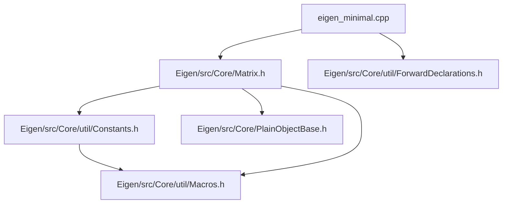

# A minimal version of Eigen

Here, I collect a minimal set of Eigen headers so that I
can learn what gets called from where.

We work with the following commit of Eigen

```
commit 0259a52b0efe75c78f48f8a21b8092cd3fff319f (HEAD -> master, origin/master, origin/HEAD)
Author: Markus Vieth <mvieth@techfak.uni-bielefeld.de>
Date:   Mon Mar 17 19:32:43 2025 +0100

    Use more .noalias()

```

Let's start with a simple example described in Eigen documentation [here](https://eigen.tuxfamily.org/dox/TopicInsideEigenExample.html).

```C++
#include <Eigen/Core>

int main()
{
    int size = 50;
    // VectorXf is a vector of floats, with dynamic size.
    Eigen::VectorXf u(size), v(size), w(size);
    u = v + w;
}

```

Our aim is to get an understanding of how this code works under the hood.
Eigen documentation already does a thorough job of explaning this. However,
to actually find stuff in the codebase is a bit tricky. We're trying to
complement the documenation by taking a course through the code base.

## Definition of `Eigen::VectorXf`

We start with the definition of `Eigen::VectorXf`. You can find this
at Line 478 of `Eigen/src/Core/Matrix.h`

```c++
EIGEN_MAKE_TYPEDEFS_ALL_SIZES(float, f)
```

This actually calls a macro defined just above in line 468.

```C++
#define EIGEN_MAKE_TYPEDEFS_ALL_SIZES(Type, TypeSuffix) \
  EIGEN_MAKE_TYPEDEFS(Type, TypeSuffix, 2, 2)           \
  EIGEN_MAKE_TYPEDEFS(Type, TypeSuffix, 3, 3)           \
  EIGEN_MAKE_TYPEDEFS(Type, TypeSuffix, 4, 4)           \
  EIGEN_MAKE_TYPEDEFS(Type, TypeSuffix, Dynamic, X)     \
  EIGEN_MAKE_FIXED_TYPEDEFS(Type, TypeSuffix, 2)        \
  EIGEN_MAKE_FIXED_TYPEDEFS(Type, TypeSuffix, 3)        \
  EIGEN_MAKE_FIXED_TYPEDEFS(Type, TypeSuffix, 4)
```

The one we will need is `EIGEN_MAKE_TYPEDEFS(Type, TypeSuffix, Dynamic, X)`.
This in turn calls another macro define in line 449.

```C++
#define EIGEN_MAKE_TYPEDEFS(Type, TypeSuffix, Size, SizeSuffix)    \
  /** \ingroup matrixtypedefs */                                   \
  /** \brief `Size`&times;`Size` matrix of type `Type`. */         \
  typedef Matrix<Type, Size, Size> Matrix##SizeSuffix##TypeSuffix; \
  /** \ingroup matrixtypedefs */                                   \
  /** \brief `Size`&times;`1` vector of type `Type`. */            \
  typedef Matrix<Type, Size, 1> Vector##SizeSuffix##TypeSuffix;    \
  /** \ingroup matrixtypedefs */                                   \
  /** \brief `1`&times;`Size` vector of type `Type`. */            \
  typedef Matrix<Type, 1, Size> RowVector##SizeSuffix##TypeSuffix;
```

The one we will use is `typedef Matrix<Type, Size, 1> Vector##SizeSuffix##TypeSuffix;`.
As you can see the macro takes 4 arguments and for our example,
their values are as shown the table below:

| Argument     | Value     |
| ------------ | --------- |
| `Type`       | `float`   |
| `TypeSuffix` | `f`       |
| `Size`       | `Dynamic` |
| `SizeSuffix` | `X`       |

The result of this macro expansion is the definition of type `VectorXf`.

```C++
typedef Matrix<float, Dynamic, 1> VectorXf;
```

The template argument which tells Eigen that the size of the matrix
is not fixed is defined in `Eigen/src/Core/util/Constants.h` line 25.

```C++
const int Dynamic = -1;
```

So, far the files we've used are


## Going deeper into `Matrix` the class

Now we're getting inside the skin. The obvious place to look is `Eigen/src/Core/Matrix.h`.
However, there's slight problem. We see that the matrix class is defined in 
line 186. However, we see that there're 6 template parameters required.

```C++
template <typename Scalar_, int Rows_, int Cols_, int Options_, int MaxRows_, int MaxCols_>
class Matrix : public PlainObjectBase<Matrix<Scalar_, Rows_, Cols_, Options_, MaxRows_, MaxCols_>>
```

We only specified 3 in the definition in the previous section. What's going on?
The key to this question lies in a file called `Eigen/src/Core/util/ForwardDeclarations.h`.
This file gets included in `Eigen/Core` in line 174. So we see that this file contains
a forward declaration of the `Matrix` calss in line 65 of `Eigen/src/Core/util/ForwardDeclarations.h`.

If you want to learn more about forward declarations and why are they necessary,
see [this stack overflow page](https://stackoverflow.com/questions/4757565/what-are-forward-declarations-in-c).

The forward declaration in in line 65 of `Eigen/src/Core/util/ForwardDeclarations.h` is

```C++
template <typename Scalar_, int Rows_, int Cols_,
          int Options_ = AutoAlign | ((Rows_ == 1 && Cols_ != 1)   ? Eigen::RowMajor
                                      : (Cols_ == 1 && Rows_ != 1) ? Eigen::ColMajor
                                                                   : EIGEN_DEFAULT_MATRIX_STORAGE_ORDER_OPTION),
          int MaxRows_ = Rows_, int MaxCols_ = Cols_>
class Matrix;
```

Now we get and idea why we specified 3 arguments and what happend to the other 3
arguments required. Let's first undertand the purpose of these arguments. Eigen's
excellent documentation is a good place start.
See this [page](https://eigen.tuxfamily.org/dox/group__TutorialMatrixClass.html)
and this [page](https://eigen.tuxfamily.org/dox/classEigen_1_1Matrix.html).
The table below summarises the arguments:

| Argument   | Purpose                                                                                    |
|------------|--------------------------------------------------------------------------------------------|
| `Scalar_`  | Numeric type, e.g. `float`, `double`, `int` or `std::complex<float>`.                      |
| `Rows_`    | Number of rows, or `Dynamic`                                                               |
| `Cols_`    | Number of columns, or `Dynamic`                                                            |
| `Options_` | A combination of either `RowMajor` or `ColMajor`, and of either `AutoAlign` or `DontAlign` |
| `MaxRows_` | Maximum number of rows. Defaults to `Rows_`                                                |
| `MaxCols_` | Maximum number of columns. Defaults to `Cols_`                                             |

Our observations are:

1. We now see that the 3 arguments `Scalar_`, `Rows_` and `Cols_` are absolutely necessary
2. `Options_`, `MaxRows_` and `MaxCols_` are derived from the above arguments.

Of these unsepecified arguments, `MaxRows_` and `MaxCols_` will only matter in certain cirum stances like
dynamic-size blocks inside fixed-size matrices. See the note on this [page](https://eigen.tuxfamily.org/dox/classEigen_1_1Matrix.html#maxrows)
for more details. For most cases they can just default to `Rows_` and `Cols_`.

However, `Options_` has a very imporant part to play. This spcifies two imporant aspects of the 
matrix raw data storage:

1. Storage order. This can be row major (`RowMajor`) or column major `ColMajor`. In other words C ordering or Fortran ordering.
2. Alignment. We know that Eigen performs vectorised (SIMD) operations. We align the allocated data except for fixed sizes that aren't multiples of the packet size.

The devils is always in the details! We see that the `Options_` argument is derived and the derivation is:

```C++
int Options_ = AutoAlign | (
    (Rows_ == 1 && Cols_ != 1) ? Eigen::RowMajor :
    (Cols_ == 1 && Rows_ != 1) ? Eigen::ColMajor :
    EIGEN_DEFAULT_MATRIX_STORAGE_ORDER_OPTION
);
```

How do we interpret this? This is a ternary conditional operator (?:) 
which is actually a shorthand for a simple if-else statement in C and C++.
The basic syntax is `condition ? expression_if_true : expression_if_false;`. 
The ternary operator chooses the appropriate storage order for:

1. First Condition (`(Rows_ == 1 && Cols_ != 1)`). If true we have `Eigen::RowMajor`.
2. Second Condition (`(Cols_ == 1 && Rows_ != 1)`). If true we have `Eigen::ColMajor`.
3. Final / default Case (`EIGEN_DEFAULT_MATRIX_STORAGE_ORDER_OPTION`). If both 1 and 2 are false

Now we're wondering where are `AutoAlign`, `RowMajor`, `ColMajor` and `EIGEN_DEFAULT_MATRIX_STORAGE_ORDER_OPTION`
are defined. These can be found in line 316 of `Eigen/src/Core/util/Constants.h`

```C++
enum StorageOptions {
  /** Storage order is column major (see \ref TopicStorageOrders). */
  ColMajor = 0,
  /** Storage order is row major (see \ref TopicStorageOrders). */
  RowMajor = 0x1,  // it is only a coincidence that this is equal to RowMajorBit -- don't rely on that
  /** Align the matrix itself if it is vectorizable fixed-size */
  AutoAlign = 0,
  /** Don't require alignment for the matrix itself (the array of coefficients, if dynamically allocated, may still be requested to be aligned) */ // FIXME --- clarify the situation
  DontAlign = 0x2
};
```

Finally `EIGEN_DEFAULT_MATRIX_STORAGE_ORDER_OPTION` can found in Line 31 of `Eigen/src/Core/util/Macros.h`.

```C++
#ifdef EIGEN_DEFAULT_TO_ROW_MAJOR
#define EIGEN_DEFAULT_MATRIX_STORAGE_ORDER_OPTION Eigen::RowMajor
#else
#define EIGEN_DEFAULT_MATRIX_STORAGE_ORDER_OPTION Eigen::ColMajor
#endif
```

So unless we pass `EIGEN_DEFAULT_TO_ROW_MAJOR` during compile time, we get the defualt set to `Eigen::ColMajor`.
There's documentation on the [storge order here](https://eigen.tuxfamily.org/dox/group__TopicStorageOrders.html).

Now our diagram of dependencies looks like:


### Deeper into the Matrix class

When we look at the definition of the class in line 185, we immediately notice that its
a sublcass of `PlainObjectBase`. Actually if you read the documentation, there's
class hierarchy which explains the design of Eigen. Look at this [page](https://eigen.tuxfamily.org/dox/classEigen_1_1Matrix.html)
and expand the Inheritance diagram of `Eigen::Matrix<Scalar_, Rows_, Cols_, Options_, MaxRows_, MaxCols_>`.
Additionally there's a page that explains the [class hierarhcy](https://eigen.tuxfamily.org/dox/TopicClassHierarchy.html).

Let's go through the class line by line. First thing we notice is the
macro `EIGEN_DENSE_PUBLIC_INTERFACE`. This is defined in line 1184 of
`Eigen/src/Core/util/Macros.h`.

```C++
#define EIGEN_DENSE_PUBLIC_INTERFACE(Derived) \
  EIGEN_GENERIC_PUBLIC_INTERFACE(Derived)     \
  typedef typename Base::PacketScalar PacketScalar;
```

This contains another macro! `EIGEN_GENERIC_PUBLIC_INTERFACE`
which is defined on line 1159 of `Eigen/src/Core/util/Macros.h`.

```C++
#define EIGEN_GENERIC_PUBLIC_INTERFACE(Derived)                                                                        \
  typedef typename Eigen::internal::traits<Derived>::Scalar                                                            \
      Scalar; /*!< \brief Numeric type, e.g. float, double, int or std::complex<float>. */                             \
  typedef typename Eigen::NumTraits<Scalar>::Real                                                                      \
      RealScalar; /*!< \brief The underlying numeric type for composed scalar types. \details In cases where Scalar is \
                     e.g. std::complex<T>, T were corresponding to RealScalar. */                                      \
  typedef typename Base::CoeffReturnType                                                                               \
      CoeffReturnType; /*!< \brief The return type for coefficient access. \details Depending on whether the object    \
                          allows direct coefficient access (e.g. for a MatrixXd), this type is either 'const Scalar&'  \
                          or simply 'Scalar' for objects that do not allow direct coefficient access. */               \
  typedef typename Eigen::internal::ref_selector<Derived>::type Nested;                                                \
  typedef typename Eigen::internal::traits<Derived>::StorageKind StorageKind;                                          \
  typedef typename Eigen::internal::traits<Derived>::StorageIndex StorageIndex;                                        \
  enum CompileTimeTraits {                                                                                             \
    RowsAtCompileTime = Eigen::internal::traits<Derived>::RowsAtCompileTime,                                           \
    ColsAtCompileTime = Eigen::internal::traits<Derived>::ColsAtCompileTime,                                           \
    Flags = Eigen::internal::traits<Derived>::Flags,                                                                   \
    SizeAtCompileTime = Base::SizeAtCompileTime,                                                                       \
    MaxSizeAtCompileTime = Base::MaxSizeAtCompileTime,                                                                 \
    IsVectorAtCompileTime = Base::IsVectorAtCompileTime                                                                \
  };                                                                                                                   \
  using Base::derived;                                                                                                 \
  using Base::const_cast_derived;

```

All this does is giving the user access derived types. In fact we have a full
documentation of major macros in [this page](https://eigen.tuxfamily.org/dox/TopicPreprocessorDirectives.html) 
which is super useful. 

Now the rest of the lines deals with various constructors of the Matrix class.
The one we're interested and is relevant to the our example is 
`Matrix(Index dim)`. This is defined on lines 317 (documented in 344) of `Eigen/src/Core/Matrix.h`.

```C++
  // This constructor is for both 1x1 matrices and dynamic vectors
  template <typename T>
  EIGEN_DEVICE_FUNC EIGEN_STRONG_INLINE explicit Matrix(const T& x) {
    Base::template _init1<T>(x);
  }
```
and

```C++
  /** \brief Constructs a vector or row-vector with given dimension. \only_for_vectors
   *
   * This is useful for dynamic-size vectors. For fixed-size vectors,
   * it is redundant to pass these parameters, so one should use the default constructor
   * Matrix() instead.
   *
   * \warning This constructor is disabled for fixed-size \c 1x1 matrices. For instance,
   * calling Matrix<double,1,1>(1) will call the initialization constructor: Matrix(const Scalar&).
   * For fixed-size \c 1x1 matrices it is therefore recommended to use the default
   * constructor Matrix() instead, especially when using one of the non standard
   * \c EIGEN_INITIALIZE_MATRICES_BY_{ZERO,\c NAN} macros (see \ref TopicPreprocessorDirectives).
   */
  EIGEN_STRONG_INLINE explicit Matrix(Index dim);
```

Now we encounter another macro `EIGEN_STRONG_INLINE`. The purpose of this is
obvious and we can see that when looking at the definition
line 840 of `Eigen/src/Core/util/Macros.h` as shown below:

```C++
#ifndef EIGEN_STRONG_INLINE
#if (EIGEN_COMP_MSVC || EIGEN_COMP_ICC) && !defined(EIGEN_GPUCC)
#define EIGEN_STRONG_INLINE __forceinline
#else
#define EIGEN_STRONG_INLINE inline
#endif
#endif
```

The second one is `EIGEN_DEVICE_FUNC`. This mainly for working with GPU.
The macro is defined in line 893 of `Eigen/src/Core/util/Macros.h`.

```C++
#if defined(SYCL_DEVICE_ONLY)
#ifndef EIGEN_DONT_VECTORIZE
#define EIGEN_DONT_VECTORIZE
#endif
#define EIGEN_DEVICE_FUNC __attribute__((flatten)) __attribute__((always_inline))
// All functions callable from CUDA/HIP code must be qualified with __device__
#elif defined(EIGEN_GPUCC)
#define EIGEN_DEVICE_FUNC __host__ __device__
#else
#define EIGEN_DEVICE_FUNC
#endif
```

As we're not working with GPUs this macro has no effect on the code.

Now let's inspect the constructor and see where it points us to. This where
we fist encounter the super class `PlainObjectBase`. We will discuss that in
the next section. Just to finish off we see that there's bit to this class
we need to say. It's about the two construtors that actually constructs its data
here.

1. `Matrix(const Scalar& x, const Scalar& y, const Scalar& z)`
2. `Matrix(const Scalar& x, const Scalar& y, const Scalar& z, const Scalar& w)`

For example, the first one creates data as per the definition on line 370 of `Eigen/src/Core/Matrix.h`.

```C++
  EIGEN_DEVICE_FUNC EIGEN_STRONG_INLINE Matrix(const Scalar& x, const Scalar& y, const Scalar& z) {
    EIGEN_STATIC_ASSERT_VECTOR_SPECIFIC_SIZE(Matrix, 3)
    m_storage.data()[0] = x;
    m_storage.data()[1] = y;
    m_storage.data()[2] = z;
  }
```

Now where does the `m_storage` comes from? Look at line 415

```C++
using Base::m_storage;
```

and base is actually defined as `typedef PlainObjectBase<Matrix> Base;` at the top of the class.

In summary the Matrix class is provides a few constructors and a few operators
which are useful. The dependecy graph now looks like:




## Dissecting `PlainObjectBase`.

It's time now to peel one more layer and go into `PlainObjectBase` class.

We start from the definition of the constructor on lines 317 (documented in 344) of `Eigen/src/Core/Matrix.h`.

```C++
  // This constructor is for both 1x1 matrices and dynamic vectors
  template <typename T>
  EIGEN_DEVICE_FUNC EIGEN_STRONG_INLINE explicit Matrix(const T& x) {
    Base::template _init1<T>(x);
  }
```

What's `_init1` doing? As we can see from the comment just above the defintion,
the constructor is used for both 1x1 matrices and dynamic vector. In our
example it's a dynamic vector. This constructor is defined on line of
`Eigen/src/Core/PlainObjectBase.h`.

```C++
  // The argument is convertible to the Index type and we either have a non 1x1 Matrix, or a dynamic-sized Array,
  // then the argument is meant to be the size of the object.
  template <typename T>
  EIGEN_DEVICE_FUNC EIGEN_STRONG_INLINE void _init1(
      Index size,
      std::enable_if_t<(Base::SizeAtCompileTime != 1 || !internal::is_convertible<T, Scalar>::value) &&
                           ((!internal::is_same<typename internal::traits<Derived>::XprKind, ArrayXpr>::value ||
                             Base::SizeAtCompileTime == Dynamic)),
                       T>* = 0) {
    // NOTE MSVC 2008 complains if we directly put bool(NumTraits<T>::IsInteger) as the EIGEN_STATIC_ASSERT argument.
    const bool is_integer_alike = internal::is_valid_index_type<T>::value;
    EIGEN_UNUSED_VARIABLE(is_integer_alike);
    EIGEN_STATIC_ASSERT(is_integer_alike, FLOATING_POINT_ARGUMENT_PASSED__INTEGER_WAS_EXPECTED)
    resize(size);
  }
```
